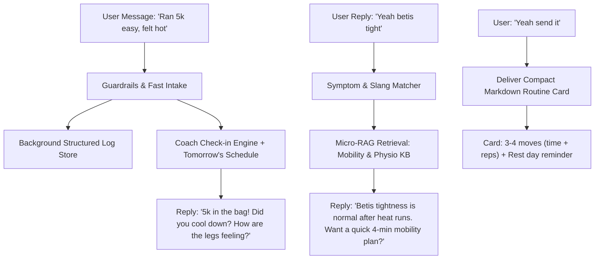

# Plan v3: Conversational Bro-Coach & Micro-RAG Evolution

> **Status:** 100% Implemented & Verified (213 hermetic tests passing).

---

## 1. Executive Summary

**Plan v3** evolves **ATrainersBot** from an analytical panel into a **natural, concise, conversational trainer ("talking to simple guys")**.

The bot keeps its deterministic math, local embeddings, and safety guardrails, but transforms the dialogue experience:
1. **Brevity & Non-Screen-Eating Text**: Punchy 1–3 line chat responses matching human energy.
2. **Interactive Check-In Loop**: Auto-checks on feeling, effort, tightness, and cool-down after every workout.
3. **Micro-RAG Routine Cards**: Deep knowledge retrieval distilled into ultra-clean 4-minute `.md` actionable routine cards (mobility, cooldowns, rehab).
4. **Proactive Rest & Recovery Awareness**: Awareness of upcoming rest vs. hard sessions with natural reminders.
5. **OpenRouter Free API Ready**: Fully compatible with high-speed free models like `google/gemini-2.0-flash-exp:free` and `meta-llama/llama-3.3-70b-instruct:free`.

---

## 2. Architecture & Interaction Flow



---

## 3. Implemented Phases

### Phase 1: Conversational Tone & Check-In Prompts
* **Fast-Log Prompt (`bot.py`)**: Acknowledges workouts casually in 1–2 short sentences and asks ONE natural follow-up check-in question (*"Did you cool down after?", "How are the calves holding up?"*).
* **Editor & Persona Prompts (`synthesize.py`, `personas/`)**: Enforces concise 1–3 short paragraph replies, eliminating robot preamble, and delivering clean dash-bulleted routines.

### Phase 2: Micro-RAG & Compact `.md` Routine Cards
* Added 3 compact, mobile-friendly micro-routines in `knowledge/mobility/`:
  * `post_run_4min_flush.md`: 4-minute post-run cooldown flush.
  * `tight_calf_betis_routine.md`: Targeted calf/betis tightness release for humid runs.
  * `rest_day_flow.md`: 5-minute restorative rest-day flow.
* Configured personas to output routines as max 3–4 bullet points with specific times/reps.

### Phase 3: Malaysian English & Rojak Slang Context
* Added colloquial terms (*peha, betis, ketat, lenguh, sengal, lemau, koyak, panas gila*) to `extract.py` and `guardrails.py`.

### Phase 4: Rest-Day & Tomorrow's Schedule Awareness
* Added `workouts.get_tomorrow_schedule` helper.
* Injected tomorrow's schedule context into both the fast log and the main persona pipeline, so the coach naturally reminds the athlete about recovery or hard efforts ahead.

---

## 4. Target Conversational Examples

### Scenario 1: Easy Run + Post-Run Check-In + Mobility Delivery
```text
You: "ran 5k easy pace just now"
Bot: "5k locked in! Solid run in that heat. Did you cool down after, or are the legs feeling tight? 
      Tomorrow is your rest day — take it easy tonight."

You: "betis a bit tight"
Bot: "Betis tightness is normal after heat runs. Want a quick 4-min mobility plan to flush it out?"

You: "yeah send it"
Bot: "Here's a quick 4-min flush before you shower:
      • Downward Dog Calf Pedal: 10 reps/side
      • Wall Soleus Stretch (bent knee): 2 × 30s each leg
      • Deep Squat Hold: 45s breathing easy
      • Ankle Rotations: 10 each direction
      
      Hydrate well and get some rest!"
```

### Scenario 2: Hard Intervals + Heat Check + Rest Day Reminder
```text
You: "done 6x400m intervals, rpe 8, panas gila"
Bot: "Beast mode. RPE 8 in this scorching heat is no joke. How are the hamstrings and heart rate feeling now? 
      Make sure to chug some electrolytes."

You: "all good just super exhausted"
Bot: "Earned that rest. Tomorrow is full recovery on the schedule. 
      Keep off your feet and I'll check in with you tomorrow morning."
```

### Scenario 3: Morning Check-In ("What should I do today?")
```text
You: "yo what's on the menu today?"
Bot: "Today is scheduled for a 6km easy conversational run. Keep your pace relaxed — you should be able to speak full sentences. 
      Want a quick 3-min dynamic warmup before you lace up?"

You: "nah already warmed up, heading out"
Bot: "Get it done! Catch you after the run."
```

### Scenario 4: Malaysian Slang / Muscle Tightness (`peha lenguh`)
```text
You: "peha and lutut rasa lenguh gila lepas semalam"
Bot: "Quad and knee fatigue after yesterday's tempo is expected. Is it just muscle soreness or any sharp pain when bending?"

You: "just sore muscles"
Bot: "Good, safe to mobilize. Here's a 3-minute quad & knee release:
      • Standing Quad Pull: 2 × 45s per leg
      • Kneeling Hip Flexor Stretch: 30s per side
      • Glute Bridges: 10 slow reps
      
      Do this once now and once before bed."
```

### Scenario 5: Safety Red-Flag (Physio Safety Veto)
```text
You: "sharp pain in my right shin every time I land"
Bot: "🛑 Stop running immediately. Sharp, localized shin pain during impact is a red flag for bone stress. 
      Rest today, do not test it with another run, and get it checked by a physio or doctor."
```

---

## 5. OpenRouter Free API Configuration

The bot uses an OpenAI-compatible client in `llm_client.py` and can be pointed directly to **OpenRouter's free tier**.

### Recommended Free Models

| Model ID | Provider | Notes |
|---|---|---|
| **`google/gemini-2.0-flash-exp:free`** | Google | **Primary recommendation**: Ultra-fast, great rojak understanding, clean JSON extraction. |
| **`meta-llama/llama-3.3-70b-instruct:free`** | Meta | **Fallback recommendation**: High-parameter instruction following and concise output control. |
| **`qwen/qwen-2.5-72b-instruct:free`** | Alibaba | Multilingual specialist with great structured output reliability. |
| **`deepseek/deepseek-r1:free`** | DeepSeek | Strong reasoning for deep triage and explain mode. |

### Environment Configuration (`.env`)

```env
TELEGRAM_BOT_TOKEN="your_bot_token"
ALLOWED_USER_IDS="123456789"

# OpenRouter Free Configuration
DEEPSEEK_API_KEY="sk-or-v1-xxxxxxxxxxxxxxxxxxxx"
DEEPSEEK_BASE_URL="https://openrouter.ai/api/v1"
PRIMARY_MODEL="google/gemini-2.0-flash-exp:free"
FALLBACK_MODEL="meta-llama/llama-3.3-70b-instruct:free"
```

---

## 6. Verification & Test Suite

Run the hermetic test suite:
```bash
.venv/bin/pytest tests/ -q
```
* **Result:** **213 passed** across all 24 test modules.
* **Key Test Coverage:** `tests/test_conversational_flow.py` verifies fast-log prompt rules, slang guardrails, schedule look-ahead, and micro-RAG retrieval.
